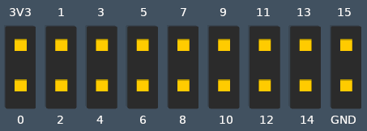

# balena-fin-firmata-flash

 This is a balena application template that has a co-processor service that allows for flashing of the balenaFin co-processor with the latest version of the [balenaFin Firmata](https://github.com/balena-io/balena-fin-coprocessor-firmata). For more information about Firmata, check out the official [repo](https://github.com/firmata/protocol).

**NOTE:** while having this interface exposed to the outside is useful for development (you can consume this interface from your laptop in order to flash and test your balenaFin) we highly suggest to change the docker-compose configuration for the co-processor service ( `network_mode: host` ) once your own business logic has this interface implemented so that only the services you deploy on the device will be able to access it.

# balenaFin device tree overlay setup

in order to allow the Raspberry Pi Compute Module to communicate via UART to the co-processor, you need to set the following configuration variable on your device (or app-wide)

`BALENA_HOST_CONFIG_dtoverlay` = `"balena-fin","uart1,txd1_pin=32,rxd1_pin=33"`

### co-processor REST interface (port 1337)

default port: `1337`

##### flash firmware

_POST_ `/v1/flash/firmware`

flashes the given firmware name from the service fs ( ie `firmware/firmata-balena-0.0.2.hex` ). The co-processor service has a volume (`/data`) that you can add to other service and use as a way to share different firmwares to flash. on balenaFin v1.1 and above, this action will trigger a reboot.

##### sleep

_POST_ `/v1/sleep/:delay/:timeout`

triggers the balenaFin power saving mode.
* `delay` (integer) is the amount of seconds the co-processor will wait before shutting down the linux side (CM3/CM3+)
* `timeout` (integer) is the amount of seconds the co-processor will keep the linux side (CM3/CM3+) shut down before bringing it back up. There is a limit of 97 years (3,058,992,000 seconds) as the max value the co-processor can handle

##### set pin

_POST_ `/v1/setpin/:pin/:state`

set digital pin state on the coprocessor header.
* `pin` (integer) is the `Expansion Header` pin numbering as shown in the image below.
* `state` (integer) is either 1 (on) or 0 (off)

